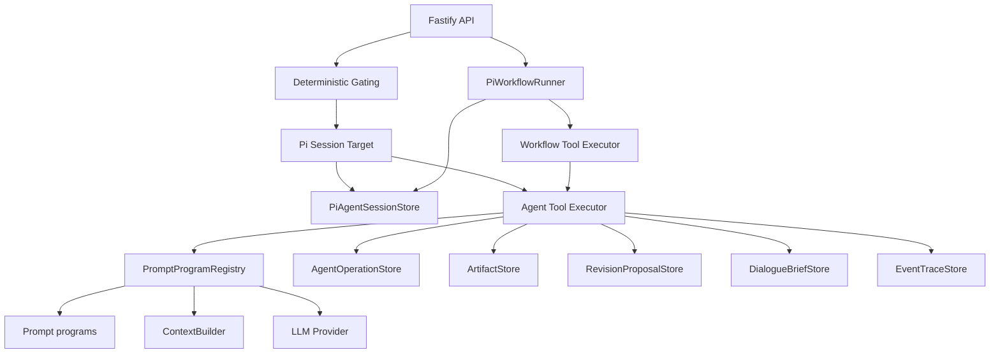

# Pi Agent Unified Runtime 设计

## 状态

核心 runtime 迁移已完成。本设计承接 `docs/pi-agent-workflow-runner-design.md`：workflow runner 已迁移到 pi-agent；API、对话、对话摘要、批注处理和局部修订不再直接调用自研 runtime 或公开的 `PromptProgramRegistry`，而是按上下文绑定 pi-agent session，并通过 `AgentToolExecutor` 执行 `ToolRegistry` 中的受限产品工具。dialogue route 已从 `app.ts` 拆出，proposal apply/dismiss 相关逻辑已进入 service。operation store 已泛化为 `AgentOperationStore`；非 workflow session 会压缩旧消息到 `compactSummary`，并维护 `toolTraceSummary`。继续拆分其它 API 路由属于后续结构债务。

## 背景

迁移前系统里有两类 LLM 执行路径：

- Workflow 路径：`PiWorkflowRunner` 恢复 pi-agent session，计算 `allowedActions`，由 pi-agent 选择动作，再通过 workflow action executor 执行。
- 非 workflow 路径：API 或 service 直接调用自研 prompt 执行器，例如对话路由、对话方案、对话摘要、批注处理、任务卡/大纲/正文局部修订。

这会导致几个问题：

- 对话和批注没有统一的 agent session、tool trace 和 operation log。
- 部分修改路径能绕过 pi-agent 的 allowed action/tool gating。
- 失败恢复、上下文压缩、brief settle、RAG 触发规则分散在 API/service 里。
- `AgentRuntime` 命名误导，它实际只是 prompt program 注册器，却被业务层当作 agent runtime 使用。

## 目标

- 非 workflow LLM 调用也通过 pi-agent session 和限定工具集执行。
- 删除自研 `AgentRuntime`，不再允许 API/service 直接调用 prompt program。
- 引入 `PromptProgramRegistry` 作为低层 prompt program 注册器，只能被产品工具执行器调用。
- 非 workflow 路径必须显式创建/恢复 pi-agent session，并通过 `AgentToolExecutor` 负责 allowed tools、tool execution、operation 和恢复。
- 将 dialogue、brief、comment、revision proposal 统一纳入 pi-agent tool 调用和 operation 审计。
- 保持外部产品 API 基本稳定，不新增通用 `/agents/*` 产品入口。
- 保留 LLM-backed prompt program，但它们只能作为 pi-agent tool 的实现细节。

## 非目标

- 不要求所有 prompt program 改成确定性函数。
- 不在第一版实现多人实时协同编辑状态。
- 不把不同用户的 pi-agent session、dialogue brief、proposal 默认共享。
- 不新增旧 runtime 与新 runtime 的长期双轨兼容。
- 不允许 fallback、本地猜测或伪成功写入 artifact。
- 不开放全局工具箱给任意 agent session。

## 目标架构



## 命名调整

| 当前名称 | 目标名称 | 说明 |
|---|---|---|
| `AgentRuntime` | 删除 | 不再保留自研 agent runtime |
| `PiWorkflowRunner` | 保留 | workflow-scoped pi-agent runner |
| 无 | `AgentToolExecutor` + session target helpers | 非 workflow 路径不保留空 runner façade，直接按上下文绑定 pi session 并执行受限工具 |
| 旧 `WorkflowOperationStore` 概念 | `AgentOperationStore` | operation log 已泛化，workflow 和非 workflow 共用 |
| `WritingAutopilotActionExecutor` | 作为写作助手产品 executor 接入通用 tool executor | workflow action 继续处理 writing-autopilot policy 和 HumanGate |

约束：

- `AppContainer` 不再暴露 `runtime: AgentRuntime`。
- `bootstrap.ts` 创建 `PromptProgramRegistry`、`ToolRegistry` 和 `AgentToolExecutor`。
- API route/service 层不得直接依赖 `PromptProgramRegistry`。
- 只有产品工具执行器可以通过 `executePromptProgram(...)` 调用 `PromptProgramRegistry`。

## Session 粒度

非 workflow pi-agent session 使用同一个 `PiAgentSessionStore`，按上下文隔离：

```text
userId + articleId + contextKind + targetId?
```

建议 context：

- `task-card`：任务卡对话和修订。
- `outline`：整体大纲对话和修订。
- `outline-item`：单个大纲项。
- `block`：正文段落和局部修改。
- `article-comment`：单条或批量批注处理。
- `dialogue-brief`：后台 brief 维护。
- `workflow`：继续由 `runId` 绑定，不和普通对话混用。

原则：

- pi-agent session 保存当前 context 的消息、tool trace、pending proposal 和 compact summary。
- 非 workflow session 超过消息阈值时，只保留最近消息，旧消息滚入 `compactSummary`；工具执行的 started/completed/failed 摘要进入 `toolTraceSummary`。
- dialogue brief 保存 article + user 层的短中期要求、禁忌、资料线索和冲突。
- 不同用户默认不共享 session、brief、proposal。

## 轻量路由和工具门控

保留 deterministic router，但职责收缩为：

1. 选择 session target。
2. 决定当前允许哪些工具。

它不再直接执行业务动作，也不直接改 artifact。

示例：

```text
解释类消息
  allowedTools: answer, ask_clarifying_question, update_dialogue_brief?

修改任务卡
  allowedTools: create_revision_proposal, revise_task_card, ask_clarifying_question, update_dialogue_brief

修改大纲
  allowedTools: create_revision_proposal, revise_outline, revise_outline_item, ask_clarifying_question, update_dialogue_brief

局部修改正文
  allowedTools: create_revision_proposal, patch_block, ask_clarifying_question, update_dialogue_brief

明确知识/引用/出处请求
  allowedTools: search_knowledge, answer_with_knowledge, update_dialogue_brief
```

RAG 工具只有在明确知识、引用、出处、脂批、资料检索意图时才进入 allowed tools。

## 写入策略

写入按风险分层。

### A. 只读回答

- 直接返回 answer。
- 记录 dialogue message、pi-agent session、operation/event。
- 不写 artifact。

### B. 低风险状态更新

可直接写：

- dialogue brief 更新。
- dialogue message 追加。
- 批注状态从 `open` 变为 `needs_input`。
- 工具失败、审计事件、operation 状态。

### C. Artifact 内容变更

默认生成 `RevisionProposal` 或 HumanGate，不直接写 artifact：

- 修改任务卡。
- 修改整体大纲。
- 修改单个大纲项。
- 修改正文段落。
- 批注处理导致正文变化。

真正写入 artifact 只能发生在 apply/confirm 阶段，并必须带：

- `articleId`
- `baseRevision`
- `operationId`
- `proposalId` 或 `humanGateId`
- `userId`
- `sessionId` 或 `agentSessionId`

## AgentOperation

旧 `WorkflowOperation` 概念已泛化为 `AgentOperation`：

```ts
interface AgentOperation {
  operationId: string;
  agentSessionId?: string;
  runId?: string;
  userId: string;
  workspaceId?: string;
  articleId?: string;
  contextKind?: string;
  targetId?: string;
  toolName: string;
  argsHash: string;
  status: "running" | "completed" | "failed";
  resultRef?: string;
  error?: string;
  articleRevisionBefore?: number;
  articleRevisionAfter?: number;
  createdAt: string;
  updatedAt: string;
}
```

规则：

- operationId 必须由业务输入稳定生成，不能用随机 id。
- completed operation 必须幂等返回原结果。
- running operation 必须返回 409、等待或进入恢复流程，不能重复执行。
- 写 artifact 的 operation 必须记录 before/after revision。
- workflow action 带 `runId`，非 workflow dialogue/proposal 带 `agentSessionId`。

## Dialogue Agent

`POST /api/articles/:articleId/dialogue` 的外部 API 保持稳定，内部变为：

1. 权限校验。
2. brief settle。
3. 解析 dialogue context。
4. deterministic gating 生成 `allowedTools`。
5. 创建或恢复当前 context 的 pi-agent session。
6. 通过 `AgentToolExecutor.executeSkillTool(...)` 调用受限工具。
7. 写 dialogue message、proposal、operation、event。
8. 返回 `DialogueResponse`。

对话 agent 可选择：

- 只读回答。
- 追问。
- 创建或刷新 proposal。
- 讨论 pending proposal，但不应用。
- 明确应用/取消 pending proposal。
- 在 allowed tools 存在时检索知识。

## Dialogue Brief Agent

Brief 是 article + user 层短中期记忆。

规则：

- 用户每次对话前先等待 pending/running brief job settle。
- brief 更新可以异步，但下一轮对话必须等待其完成。
- running job 超时后标记 interrupted/failed，再按 retry 规则恢复。
- brief 更新失败时 fail closed，不用本地 fallback 抽取要求。
- proposal 生成只读取 compact brief，不带全量历史。
- 新要求默认 supersede 旧冲突要求，除非用户明确要求同时保留。

## Article Comment Agent

批注处理保留 workflow action 入口：

```text
writing-autopilot process_article_comments
  -> article-comment pi-agent
  -> comment-level proposal / question / explanation
```

目标：

- 用户入口仍是 workflow action，保留 operationId、baseRevision、事件和批量进度。
- 单条批注理解迁移到 `article-comment` pi-agent session。
- 解释/追问可以直接更新批注状态。
- 需要改正文时生成 proposal 或批量可审阅建议，不直接改正文。
- 单条批注失败只标记该批注 `needs_input`，批量流程继续处理其他批注。

## PromptProgramRegistry

保留 LLM-backed prompt program，但它们只能由 pi-agent tool 调用。

硬约束：

- prompt program 只返回结构化 output。
- prompt program 不直接读写 store。
- prompt program 不直接做 RAG，除非该 program 明确是 knowledge/search tool。
- prompt program 不决定是否应用 proposal。
- prompt program 的 LLM 调用必须由 `PromptProgramRegistry` 记录 started/completed/failed 和 usage。
- API route/service 不得直接调用 prompt program。

## 失败和恢复

采用 fail closed + 可恢复重试。

| 场景 | 策略 |
|---|---|
| 只读回答失败 | 返回错误或追问，不写 artifact |
| brief 更新失败 | fail closed；下一轮必须恢复或报告失败 |
| proposal 生成失败 | 保留用户消息和 failed operation，不改 artifact |
| artifact 写入失败 | 返回 409/500，proposal 保持 pending 或 stale |
| comment resolver 失败 | 单条批注 `needs_input`，批量继续 |
| running operation 超时 | 标记 interrupted/failed，可按同 operationId retry |
| running session 恢复 | 读取 tool trace，决定继续、重试或要求用户确认 |

不允许 fallback、本地猜测字段、伪造成功、或失败后直接写正文。

## 多用户和协作

第一版规则：

- workspace access 决定 article/comment 读权限。
- article artifact 和 comment 是共享对象。
- pi-agent session、dialogue brief、proposal 默认按 user 隔离。
- proposal 绑定 `authorUserId/userId/baseRevision`。
- apply proposal 时应用者必须有 workspace access；如果不是作者，记录 `appliedByUserId`。
- workflow run 当前按 user 创建，但 running article lock 按 article 生效。

共享 proposal、协作 presence、共同编辑状态后续单独设计。

## API 边界

外部 API 保持稳定：

```text
POST /api/articles/:articleId/dialogue
GET  /api/articles/:articleId/dialogue/messages
GET  /api/articles/:articleId/dialogue/proposals
POST /api/articles/:articleId/dialogue/:proposalId/apply
POST /api/articles/:articleId/dialogue/:proposalId/dismiss

POST /api/workflows/writing/start
POST /api/workflows/:runId/message
POST /api/workflows/:runId/human-gates/:gateId/resolve
POST /api/workflows/:runId/cancel

POST /api/articles/:articleId/comments
POST /api/articles/:articleId/comments/:commentId/replies
DELETE /api/articles/:articleId/comments/:commentId
DELETE /api/articles/:articleId/comments/:commentId/replies/:replyId
```

内部规则：

- dialogue route 只做权限、参数、session target 和 tool gating，然后交给非 workflow pi-agent runtime。
- comments 的新增、回复、删除仍是确定性 REST。
- brief 更新不暴露用户直接调用 API。
- 不新增通用 `/agents/*` 产品入口。

## 性能预算

| 场景 | 预算 |
|---|---|
| 只读解释/普通讨论 | 不触发 RAG，不生成 proposal，最多一次 pi-agent LLM 决策或本地 answer |
| 生成/刷新 proposal | 先 settle brief，再一次 agent decision + 一次 LLM-backed prompt program |
| RAG 问答 | 只有明确检索意图才开放 search tool；最多一次 search + 一次 answer/proposal |
| 批注批量处理 | 每条批注独立 operation；UI 展示逐条进度；失败不阻塞其他条 |

上下文策略：

- 只恢复当前 context 的 pi-agent session。
- proposal 使用 compact brief + selected context。
- 不向普通对话默认注入整篇文章和全部历史。
- 重复请求通过 operation log 幂等返回。

## 迁移阶段

### 阶段 1：抽底座

- `AgentRuntime` 删除或重命名为 `PromptProgramRegistry`。
- `PromptProgramRegistry` 只保留 prompt program registry、context builder、LLM provider、事件和 schema 校验。
- `AppContainer` 不再暴露 `runtime`。
- workflow action executor 改注入 `AgentToolExecutor`，不直接持有 `PromptProgramRegistry`。

### 阶段 2：非 workflow agent tool boundary

- 新增 agent session target helper，不保留未接入的 `NonWorkflowPiAgentRunner` façade。
- 新增 allowed tool gating、agent session target、agent operation id。
- 新增 `AgentToolExecutor`。
- 建立 contextKind + targetId 的 session 恢复和压缩策略。

### 阶段 3：迁移 dialogue

- `/api/articles/:id/dialogue` 不再直接调用 `dialogue-router`、`dialogue-coordinator`、reviser 或 patch program。
- 对话修改默认产出 proposal。
- apply/dismiss 走 agent operation + revision 校验。
- 显式 RAG 才开放 search tool。

### 阶段 4：迁移 brief

- `dialogue-brief-updater` 通过 brief agent tool 执行。
- 保留异步 job 和下一轮 settle 机制。
- 补齐 interrupted job 的 retry/failed operation 记录。

### 阶段 5：迁移 comment

- `process_article_comments` workflow action 调用 article-comment pi-agent。
- 正文变更产出 proposal 或批量建议。
- 单条失败进入 `needs_input`。

### 阶段 6：删除直连面

- `rg "runtime.invokeSkill|container.runtime"` 在 API/service 中应为零。
- 测试改为 mock pi-agent/tool executor，不 monkey patch route runtime 或公开 `PromptProgramRegistry`。
- 更新模块文档和技术架构图。

## 文件拆分要求

runtime 边界已经收敛，API 大文件拆分仍需继续推进。已完成 dialogue route 和 revision proposal service 拆分；后续拆分时仍应移动代码和行为修改分提交。

建议结构：

```text
apps/api/src/
  agent/
    agentToolExecutor.ts
    agentOperationIds.ts
    agentSessionTarget.ts
    allowedTools.ts
  routes/
    dialogueRoutes.ts
    workflowRoutes.ts
    articleRoutes.ts
    commentRoutes.ts
    knowledgeRoutes.ts
  services/
    revisionProposalService.ts
    dialogueBriefService.ts
    articleCommentAgentService.ts
```

第一批已做到：

- 新 agent runtime 代码不进入 `app.ts`。
- dialogue route 从 `app.ts` 拆出。
- proposal apply/dismiss 相关逻辑进入 service。
- `bootstrap.ts` 只做 runtime 和 store 组装。

## 验收标准

### 代码结构

- `AppContainer` 不再暴露 `AgentRuntime runtime`。
- API route/service 层没有 `container.runtime.invokeSkill`。
- 只有 `AgentToolExecutor` / `PromptProgramRegistry` 可以调用 `PromptProgram.invoke`。
- 非 workflow LLM 调用都必须有 `piAgentSessionId` 或明确的 agent session target。
- 非 workflow tool 调用写入 `AgentOperation`。

### API 行为

- dialogue 修改只生成 proposal，不直接改 artifact。
- apply proposal 写 artifact，并校验 revision。
- stale proposal apply 返回 409，proposal 不被误标记为 applied。
- 普通解释不生成 proposal，不触发 RAG。
- 明确知识/引用/出处请求才有 knowledge search event。
- interrupted brief job 在下一轮对话前恢复或 fail closed。
- comment processing 不直接改正文；正文变更以 proposal 或可审阅建议呈现。

### 浏览器行为

- 普通解释只显示回答，不出现 proposal/RAG 进度。
- 更新任务卡、大纲、正文局部修改生成 proposal，并可应用。
- stale proposal 阻止写入。
- 批注处理显示待应用建议或追问。
- 多用户切换不串 session、brief、proposal。
- 运行中断恢复后 UI 能看到 brief 已同步或明确失败状态。

### 性能

- 非 RAG 对话不调用 knowledge search。
- proposal 生成不携带全量历史。
- 重复提交不重复执行 completed operation。
- brief 异步更新不会阻塞当前只读回答；下一轮需要 proposal 时必须等待 settle。
