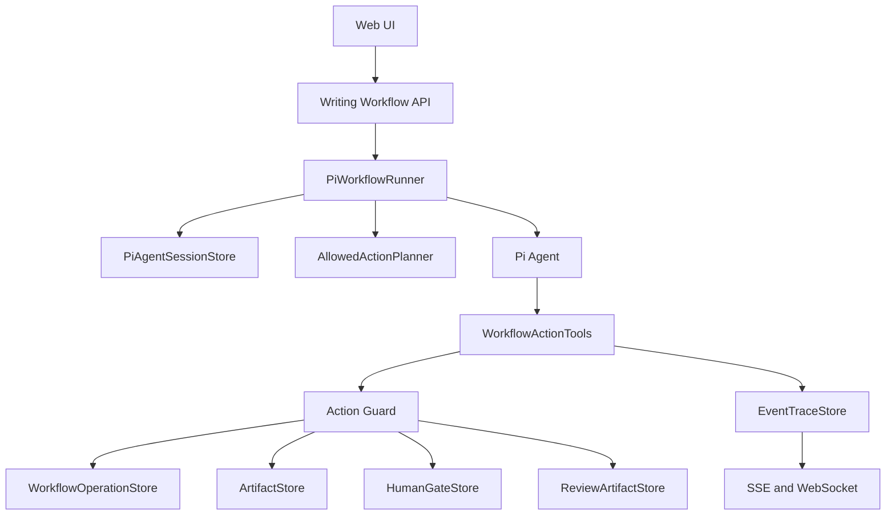

# Pi Agent Workflow Runner 重构设计

## 状态

实施中。当前已落地 `writing-autopilot`、pi-agent decision provider、独立 HumanGate、WorkflowOperation 幂等日志、ReviewArtifact、`create_revision_proposal`、proposal apply/dismiss 回流、workflow message 刷新 pending proposal、workflow proposal 续聊持久化、批注处理 workflow action、统稿建议可应用提案化、开发期多用户工作台隔离、统一 `/api/workflows/writing/start`、旧节点式 runner/queue 删除，并移除批注处理、任务卡确认、任务卡智能修订和大纲项智能修订的直连 REST 入口。手工大纲编辑、正文批注写入、任务删除也已纳入 revision 校验和 operation 审计。workflow proposal 浏览器端展示、续聊 dirty 提示、更新方案交互已完成真实本地验收，并补充了前端状态自动化覆盖。

仍需补齐的重点：更完整的端到端自动化覆盖，尤其是真实浏览器下的创建任务、开始写作、批注处理和统稿 proposal 回归。

本文记录一次破坏式重构方案：以 `@earendil-works/pi-agent-core` 作为 workflow runner 基座，让 agent 在受控边界内自主选择下一步，并统一工具调用。重构后不保留旧节点式 workflow 双轨兼容。

## 目标

- 用 pi-agent 承担 workflow runner 的执行循环。
- 合并现有固定入口，形成 `writing-autopilot` 主 workflow。
- 支持多用户隔离，先使用开发期用户切换器，不接完整登录系统。
- 让 agent 从后端计算出的 `allowedActions` 中选择下一步。
- 统一任务卡、大纲、正文、批注、统稿、一致性检查等工具调用。
- 所有写入具备 revision 校验、幂等保护和审计记录。
- 通过独立 `HumanGate` 表达需要用户确认的动作。

## 非目标

- 不做旧 `WorkflowRunner` 和新 runner 的双轨兼容。
- 不保留旧节点式 `WorkflowDefinition` 作为主流程模型。
- 不做多人实时协同编辑。
- 不开放同一篇文章多个章节并行写入。
- 不允许 agent 调用未出现在 `allowedActions` 中的工具。
- 不允许后台自动覆盖、清空或使已有内容过期。

## 架构总览



## 核心原则

### Agent 选择动作，状态机约束动作

pi-agent 可以自主选择下一步，但只能从 runner 本轮注入的 `allowedActions` 中选择。工具层必须二次校验：

- `allowedActionId`
- `operationId`
- `baseRevision`
- user/workspace/article 权限
- 当前文章状态
- 是否需要 `HumanGate`
- 幂等执行状态

### 自动生成可以，危险写入需要 HumanGate

允许自动落库：

- 创建任务卡草稿。
- 创建 article draft。
- 生成大纲草稿，前提是不覆盖已有大纲或下游正文。
- 生成一致性检查结果。
- 写未写过的下一节正文。
- 生成统稿报告。

必须进入 `HumanGate`：

- 修改已存在任务卡。
- 替换或修订已有大纲。
- 任何会清空、覆盖或使下游内容过期的动作。
- 重写已有正文 section。
- 应用正文 patch。
- 应用统稿建议。
- 删除内容。

### 正文自动写作是串行的

第一版按 `outline.order` 写第一个未完成章节。每次最多自动写一节，写完重新计算 `allowedActions`。不允许同一 article 多节并行写入。

自动流程停止条件：

- 所有大纲项都已写作完成。
- 任何章节生成失败。
- 来源不足。
- 一致性检查出现 blocking issue。此时 runner 生成待确认修改方案并等待用户应用或取消。

全部章节完成后，自动生成统稿报告和修改建议；有可修订建议时生成待确认 proposal，但不自动应用。

## 新 Workflow 模型

旧模型：

```ts
WorkflowDefinition {
  id
  startNodeId
  nodes
}
```

目标模型：

```ts
WorkflowPolicy {
  id: "writing-autopilot";
  goal: string;
  allowedActionPolicy: AllowedActionPolicy;
  humanGatePolicy: HumanGatePolicy;
  completionPolicy: CompletionPolicy;
}
```

API 负责创建、取消和查询 `writing-autopilot` run；`PiWorkflowRunner` 不再按固定 `next` 节点推进，而是反复执行：

1. 读取 run、article、workspace、user、pi session。
2. 计算 `allowedActions`。
3. 恢复 pi agent state。
4. 注入当前状态、约束和工具。
5. 让 agent 选择 action/tool。
6. 工具执行并写入 operation log。
7. 保存 artifact、human gate、review artifact 或事件。
8. 保存 pi session。
9. 判断 completed、waiting、failed 或继续下一轮。

## API

删除旧固定 workflow 语义：

```text
POST /api/workflows/task-card/start
POST /api/workflows/outline/start
POST /api/workflows/section/start
POST /api/workflows/patch/start
POST /api/workflows/:runId/resume
```

目标 API：

```text
POST /api/workflows/writing/start
POST /api/workflows/:runId/message
POST /api/workflows/:runId/human-gates/:gateId/resolve
POST /api/workflows/:runId/cancel
GET  /api/workflows/:runId
GET  /api/workflows/:runId/events
```

前端按钮不再直连固定 workflow。按钮只发送 intent，例如：

- 生成大纲：请推进到大纲。
- 开始写作：请从当前状态继续写作。
- 重写：请生成重写 proposal。
- 处理批注：请处理当前批注意见。

## 数据模型

### PiAgentSession

```ts
interface PiAgentSession {
  id: string;
  runId?: string;
  userId: string;
  workspaceId?: string;
  articleId?: string;
  contextKind: "workflow" | "task-card" | "outline" | "outline-item" | "block" | "article-review";
  targetId?: string;
  messages: unknown[];
  compactSummary?: string;
  toolTraceSummary?: string;
  pendingHumanGateId?: string;
  baseArticleRevision?: number;
  lockVersion: number;
  createdAt: string;
  updatedAt: string;
}
```

一个 `writing-autopilot` workflow run 绑定一个 workflow-scoped pi session。普通对话可以按 `userId + articleId + contextKind + targetId` 另建 session，不能和 workflow run session 混用。

### HumanGate

```ts
interface HumanGate {
  id: string;
  runId: string;
  userId: string;
  articleId?: string;
  actionType: string;
  targetKind: "task-card" | "outline" | "outline-item" | "block" | "article";
  targetId?: string;
  proposalId?: string;
  question: string;
  options: Array<{ id: string; label: string; payload?: unknown }>;
  baseRevision?: number;
  status: "pending" | "accepted" | "rejected" | "superseded";
  createdAt: string;
  updatedAt: string;
}
```

`WorkflowRun.status = waiting` 只表示运行暂停。`HumanGate` 表示用户需要确认的具体事项。

### WorkflowOperation

```ts
interface WorkflowOperation {
  operationId: string;
  runId?: string;
  userId: string;
  articleId?: string;
  toolName: string;
  allowedActionId: string;
  argsHash: string;
  status: "running" | "completed" | "failed";
  resultRef?: string;
  error?: string;
  articleRevisionBefore?: number;
  articleRevisionAfter?: number;
  createdAt: string;
  updatedAt: string;
}
```

`WorkflowOperation` 是幂等和审计依据，不能只依赖 `EventTraceStore`。Workflow runner 内的工具操作必须绑定 `runId`；普通对话 proposal 应用产生的写入可以只绑定 `articleId + userId + operationId`，不创建伪 workflow run。

### ReviewArtifact

```ts
interface ReviewArtifact {
  id: string;
  articleId: string;
  runId: string;
  type: "consistency-review" | "polish-report";
  baseRevision: number;
  findings: Array<{
    severity: "info" | "warning" | "blocking";
    targetKind: string;
    targetId?: string;
    message: string;
  }>;
  suggestions: Array<{
    id: string;
    actionType: string;
    targetKind: string;
    targetId?: string;
    summary: string;
  }>;
  createdAt: string;
  updatedAt: string;
}
```

一致性检查和统稿报告保存为独立 artifact，在右侧显示为审阅建议，不塞进正文 block。

### Article Revision

`ArticleArtifact` 增加：

```ts
revision: number;
```

所有写入工具必须携带 `baseRevision`。写入成功后 revision 递增。revision 不匹配时不得直接写入，应生成 blocking result 或 human gate。

## Allowed Actions

`AllowedActionPlanner` 负责根据当前状态生成本轮可调用动作。

```ts
interface AllowedAction {
  id: string;
  operationId: string;
  type:
    | "create_task_card_draft"
    | "ask_followup"
    | "plan_outline"
    | "review_task_card_outline_consistency"
    | "write_next_section"
    | "write_section"
    | "process_article_comments"
    | "generate_polish_report"
    | "create_revision_proposal"
    | "request_human_gate";
  articleId?: string;
  sectionId?: string;
  reviewArtifactId?: string;
  suggestionId?: string;
  targetKind?: string;
  targetId?: string;
  baseRevision?: number;
  requiresHumanGate: boolean;
  reason: string;
}
```

规则：

- runner 生成 `operationId`。
- agent 不得自造 operationId。
- agent 只能选择 `allowedActions` 中的 action。
- tool registry 拒绝任何未授权 action。
- 每次写正文最多只暴露一个 `write_next_section` action。
- 一致性检查出现 blocking issue 时，下一轮只暴露 `create_revision_proposal`；生成待确认修改方案后 workflow 等待用户处理，不继续写正文。

## 工具集合

目标工具：

- `create_task_card_draft`
- `ask_followup`
- `plan_outline`
- `review_task_card_outline_consistency`
- `write_next_section`
- `write_section`
- `process_article_comments`
- `generate_polish_report`
- `create_revision_proposal`
- `request_human_gate`

工具必须满足：

- 参数 schema 明确。
- 幂等。
- 检查权限。
- 检查 `baseRevision`。
- 检查 `operationId`。
- 只通过 store 原子方法写入。
- 写入 `WorkflowOperation`。
- 写入 `EventTraceStore`。

## Agent Decision

每轮 agent 必须形成结构化 decision，不能只有自然语言。

```ts
interface AgentDecision {
  intent: string;
  selectedActionId?: string;
  rationale: string;
  requiresHumanGate: boolean;
  stopReason?: "completed" | "waiting" | "blocked" | "failed";
}
```

decision 和工具调用都需要进入 operation/event 记录，便于调试和审计。

## 前端调整

目标布局：

- 左侧：工作台、任务、开发用户切换器。
- 中间：任务卡、大纲、正文。
- 底部：统一对话入口。
- 右侧：建议、HumanGate、执行日志、知识引用、修订日志。

右侧需要显示：

- 当前建议下一步。
- pending human gates。
- blocking consistency findings。
- polish report。
- 最近 tool execution 日志。

## 多用户第一阶段

第一阶段不接完整登录系统，使用开发期用户切换器：

- 前端保存 `userId` 到 localStorage。
- API 每次解析 `UserContext`。
- 所有 article/workspace 查询都做权限检查。
- pi agent session 唯一键包含 `userId`。
- proposal、human gate、operation 都记录 `userId`。

后续协作状态在此基础上增加 workspace members、roles、共享 review suggestions 和 proposal approval。

## 数据迁移

提供开发迁移脚本：

1. 保留 workspaces 和 articles。
2. 给 articles 补 `revision`。
3. 删除旧 runs。
4. 删除旧 events。
5. 删除旧 pi sessions、human gates、operation logs、review artifacts。

旧 run 没有 pi agent state，迁移价值低，不保留。

## 实施顺序

1. 更新文档和架构约束。
2. 增加 schema/store：article revision、pi sessions、human gates、operations、review artifacts。
3. 增加开发用户切换器和 API `UserContext`。
4. 实现 `AllowedActionPlanner`。
5. 实现 `WorkflowActionTools` 和 `ToolRegistry`。
6. 实现 `PiWorkflowRunner`。
7. 替换后端 workflow API 为 `writing-autopilot`。
8. 改前端 intent、human gate、execution log 和 review suggestions。
9. 增加迁移脚本。
10. 删除旧节点式 runner paths。
11. 增加测试并验证本地实例。

## 验收场景

- 切换用户后，任务、对话和 pi agent session 隔离。
- 用户输入写作需求后，agent 自动创建任务卡草稿和文章草稿。
- 信息不足时，agent 自动追问。
- 信息足够时，agent 自动生成大纲草稿。
- 大纲生成后自动做任务卡和大纲一致性检查。
- 一致性通过后，agent 串行生成所有未写章节。
- 来源不足或 blocking issue 出现时停止，并生成建议。
- 全部章节写完后自动生成统稿报告。
- 覆盖已有大纲或正文时进入 HumanGate，不直接写入。
- 重试同一个 operationId 不重复写入。
- revision 冲突会阻止写入。
