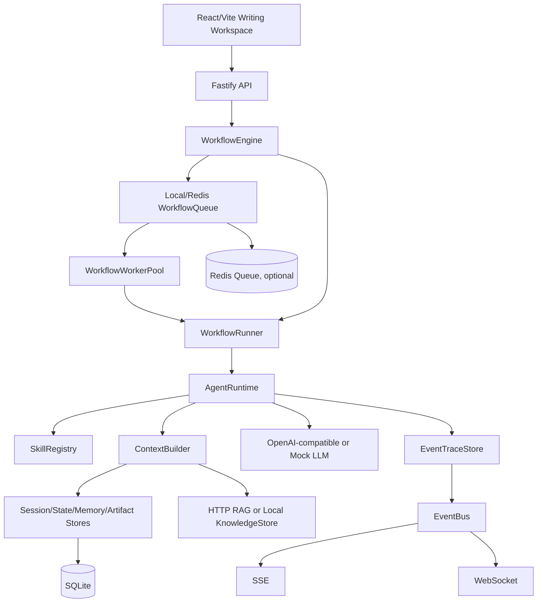

# 技术架构

## 总览



## 组件分层

| 层 | 组件 | 作用 |
|---|---|---|
| UI | React/Vite | 任务卡、文章编辑、知识面板、patch 预览、实时事件 |
| API | Fastify | REST、SSE、WebSocket、配置、容器组装 |
| Workflow | WorkflowEngine | 工作流注册、启动、恢复、取消、异步入队 |
| Execution | WorkflowRunner | 执行单个 workflow run 的节点 |
| Queue | LocalWorkflowQueue / RedisWorkflowQueue | 异步任务排队和重试 |
| Workers | WorkflowWorkerPool | 多 runner 并发消费队列 |
| Agent | AgentRuntime | 调用 skill、LLM、ContextBuilder、Evaluator |
| Skill | SkillRegistry | 管理任务卡、大纲、章节、patch 等能力包 |
| Context | DefaultContextBuilder | 动态组合 Session/State/Memory/Artifact/Knowledge |
| Store | SQLite stores | 外部化保存 Session/State/Memory/Artifact/Knowledge/EventTrace |
| Realtime | EventBus + SSE/WS | 推送 workflow、queue、RAG、artifact 事件 |
| RAG | HttpRagKnowledgeStore | 通过 HTTP POST 访问真实 RAG 服务 |

## Engine 与 Runner

- WorkflowEngine：管理 workflow 定义、run 创建、resume/cancel、execution mode、queue enqueue。
- WorkflowRunner：只负责执行某一次 run 的当前节点，调用 AgentRuntime 和 Store。
- WorkflowWorkerPool：在 async 模式下创建多个 runner 并发消费队列。

## 执行模式

### inline

```text
API request → Engine.startWorkflow → Runner.runUntilBlocked → response
```

适合本地调试和短任务。

### async

```text
API request → Engine.startWorkflow → queue.enqueue → response queued
worker → queue.reserve → Runner.runUntilBlocked → EventBus/SSE/WS
```

适合长文、慢 RAG、多人并发。

## HTTP RAG 协议

搜索：

```text
POST {RAG_BASE_URL}{RAG_SEARCH_PATH}
```

请求：

```json
{ "query": "...", "limit": 6, "themeTags": [] }
```

返回字段会标准化为 `KnowledgeItem`：

```ts
type KnowledgeItem = {
  id: string;
  title: string;
  content: string;
  sourceType: string;
  sourceRef: string;
  themeTags: string[];
  createdAt: string;
};
```

## 实时事件

SSE：

```text
GET /api/runs/:runId/stream
GET /api/events/stream?runId=&userId=
```

WebSocket：

```text
WS /api/events/ws?runId=&userId=
```

事件会同时写入 EventTraceStore 并发布到 EventBus。
