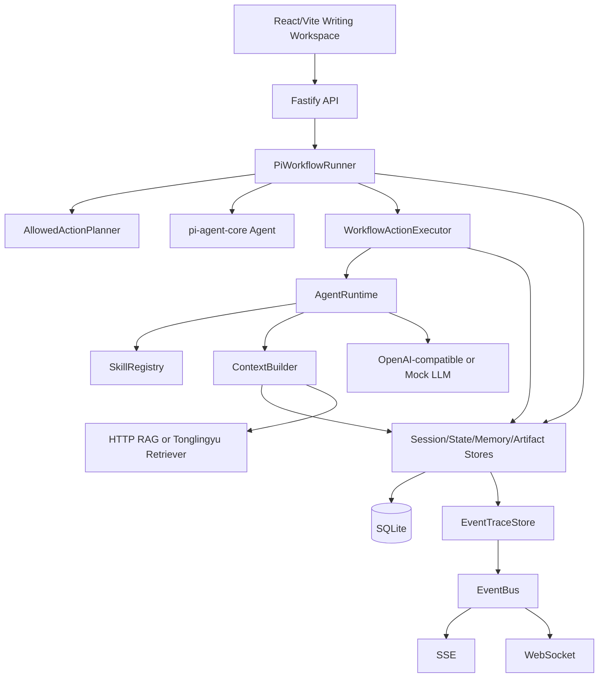

# 技术架构

## 总览



## 组件分层

| 层 | 组件 | 作用 |
|---|---|---|
| UI | React/Vite | 任务、任务卡、待确认项、大纲、正文批注、辅助信息、实时事件 |
| API | Fastify | REST、SSE、WebSocket、配置、容器组装 |
| Workflow | PiWorkflowRunner | 读取当前状态，生成 allowed actions，推进 `writing-autopilot` |
| Agent | pi-agent-core Agent | 在 runner 给定的动作集合内选择下一步 |
| Execution | WorkflowActionExecutor | 执行幂等工具，写入 task card、outline、section、review artifact |
| HumanGate | HumanGateStore | 独立保存用户确认点，例如确认任务卡、覆盖当前大纲 |
| Operation | WorkflowOperationStore | 保存幂等 operationId、工具状态和 article revision；workflow 工具绑定 run，普通对话 proposal 写入绑定 article/user |
| Skill | SkillRegistry | 管理任务卡、大纲、章节、对话、批注处理等能力包 |
| Context | DefaultContextBuilder | 动态组合 Session/State/Memory/Artifact/Knowledge |
| Store | SQLite stores | 外部化保存 Session/State/Memory/Artifact/Knowledge/EventTrace/pi session |
| Realtime | EventBus + SSE/WS | 推送 workflow、tool、RAG、artifact、review 事件 |
| RAG | HttpRagKnowledgeStore / TonglingyuRetrieverKnowledgeStore | 通过 HTTP POST 访问通用 RAG 或 tonglingyu-knownledge retriever |

## Workflow Runner

`PiWorkflowRunner` 是写作主流程的唯一入口。API 创建 `writing-autopilot` run 后，runner 循环执行：

1. 读取 run、article、workspace、user、pi session。
2. 检查 pending HumanGate。
3. 计算 allowed actions。
4. 恢复或创建 pi-agent session。
5. 让 pi-agent 在 allowed actions 中选择下一步。
6. 通过幂等 executor 调用工具。
7. 写入 artifact、operation、HumanGate、review artifact 和事件。
8. 判断 run 进入 `waiting`、`completed`、`failed` 或继续下一轮。

## HTTP RAG 协议

通用 RAG 搜索：

```text
POST {RAG_BASE_URL}{RAG_SEARCH_PATH}
```

请求：

```json
{ "query": "...", "limit": 6, "themeTags": [] }
```

Tonglingyu retriever：

```text
POST {RAG_BASE_URL}/retrieve
```

请求使用 `query` 和 `top_k`；响应读取 `evidence_pack.docs[]` 并映射为 `KnowledgeItem[]`。

## 实时事件

SSE：

```text
GET /api/workflows/:runId/stream
GET /api/events/stream?runId=&userId=
```

WebSocket：

```text
WS /api/events/ws?runId=&userId=
```

事件会同时写入 EventTraceStore 并发布到 EventBus。
